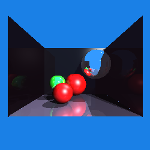

# Raytracer
Toy raytracing implementation with Phong model



### TODO

- [ ] Speed up. Numba / Rust implementation
- [ ] Cube object's class 

<h2>Setup</h2>

#### Install requirements.

```
pip3 install numpy opencv-python
```
